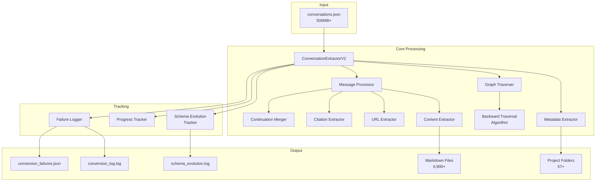
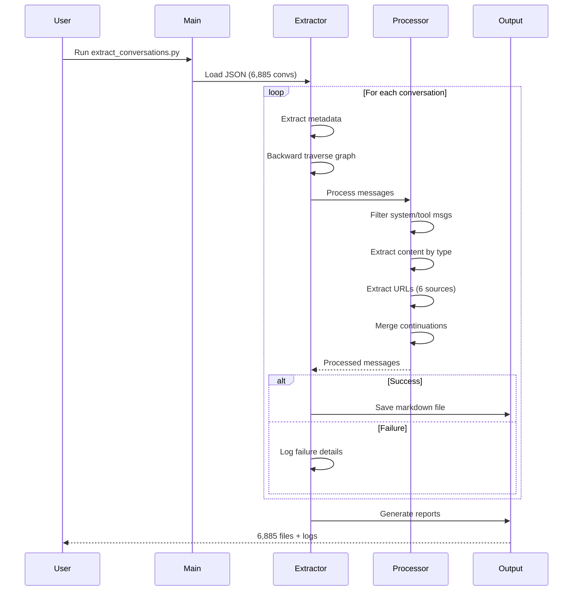
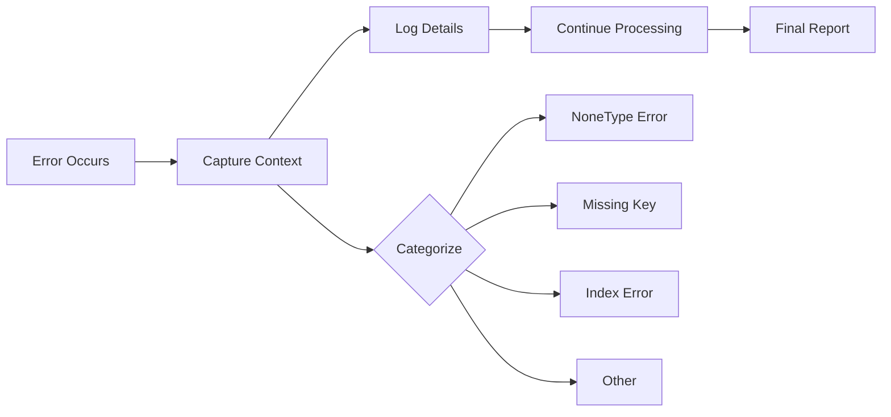

# ChatGPT Conversation Extractor - System Architecture

## Table of Contents
1. [System Overview](#system-overview)
2. [Architecture Diagram](#architecture-diagram)
3. [Component Design](#component-design)
4. [Data Flow](#data-flow)
5. [Processing Pipeline](#processing-pipeline)
6. [Error Handling Strategy](#error-handling-strategy)
7. [Performance Characteristics](#performance-characteristics)

## System Overview

The ChatGPT Conversation Extractor is a Python-based ETL (Extract, Transform, Load) system designed to process ChatGPT conversation exports from JSON format into human-readable Markdown files with comprehensive metadata preservation and error tracking.

### Key Capabilities
- **Scale**: Processes 6,000+ conversations (500MB+ JSON)
- **Performance**: 65-100 conversations/second
- **Reliability**: 99%+ success rate with defensive error handling
- **Observability**: Comprehensive logging and failure tracking

## Architecture Diagram



## Component Design

### 1. ConversationExtractorV2 (Main Orchestrator)
```python
class ConversationExtractorV2:
    """Main extraction orchestrator"""
    
    Responsibilities:
    - Load and validate JSON input
    - Orchestrate processing pipeline
    - Manage output directory structure
    - Coordinate tracking components
    - Generate final reports
```

### 2. MessageProcessor (Content Handler)
```python
class MessageProcessor:
    """Process and filter messages"""
    
    Key Methods:
    - should_filter_message()  # Filtering logic
    - extract_message_content()  # Content extraction
    - extract_citations()  # Citation extraction
    - extract_web_urls()  # URL extraction (6 sources)
    - extract_file_names()  # File attachment handling
```

### 3. SchemaEvolutionTracker (Change Monitor)
```python
class SchemaEvolutionTracker:
    """Track unknown patterns for future updates"""
    
    Monitors:
    - content_types
    - author_roles
    - recipient_values (tools)
    - metadata_keys
    - part_types
    - finish_types
```

### 4. ProgressTracker (User Feedback)
```python
class ProgressTracker:
    """Real-time progress with ETA"""
    
    Features:
    - Rate calculation (conv/sec)
    - ETA estimation
    - Success/failure counts
    - Milestone updates (every 100 or 5 sec)
```

## Data Flow



## Processing Pipeline

### Phase 1: Input Validation
```python
1. Load JSON file
2. Validate structure (array of conversations)
3. Count conversations for progress tracking
4. Initialize output directory
```

### Phase 2: Conversation Processing
```python
For each conversation:
    1. Extract metadata (id, title, timestamps, etc.)
    2. Detect project membership (template_id)
    3. Traverse conversation graph:
        - Start from current_node
        - Walk backwards to root
        - Collect messages in order
    4. Filter messages:
        - Include: user, assistant, user system prompts
        - Exclude: tools, hidden, thoughts, reasoning
    5. Process content by type:
        - text → extract from parts[]
        - code → format with language
        - multimodal_text → process each part
        - execution_output → format as output
        - user_editable_context → extract instructions
    6. Extract supplementary data:
        - Citations with validation
        - Web URLs from 6+ sources
        - File attachment names
    7. Merge consecutive assistant messages
    8. Generate markdown with YAML frontmatter
    9. Save to appropriate directory
```

### Phase 3: Report Generation
```python
1. Schema Evolution Report:
    - Unknown content types
    - New author roles
    - New tool recipients
    - Unknown part types
    
2. Conversion Failure Log (if any):
    - Categorized failures
    - Detailed diagnostics
    - Problematic node samples
    - Stack traces
```

## Error Handling Strategy

### Defensive Programming Principles



### Error Categories and Handlers

| Category | Cause | Handler | Recovery |
|----------|-------|---------|----------|
| NoneType | `parts = None` | Check before access | Return empty string |
| KeyError | Missing field | Use `.get()` with default | Skip field |
| IndexError | Empty arrays | Check length first | Skip processing |
| Malformed | Invalid structure | Try alternative extraction | Log and continue |

### Failure Logging Structure
```python
{
    'conversation_id': str,
    'title': str,
    'category': str,  # Automatic categorization
    'error_message': str[:500],
    'statistics': {
        'total_messages': int,
        'branches': int,
        'none_content': int,
        'none_parts': int
    },
    'problematic_nodes': [...],  # First 3
    'trace_snippet': str
}
```

## Performance Characteristics

### Benchmarks
| Metric | Value | Notes |
|--------|-------|-------|
| Input Size | 500MB+ | 6,885 conversations |
| Processing Rate | 65-100 conv/sec | Varies by complexity |
| Memory Usage | ~1GB peak | For 500MB input |
| Success Rate | 99%+ | With all fixes |
| Output Size | 135MB | Markdown files |
| Total Time | ~100 seconds | For full dataset |

### Optimization Techniques

1. **Backward Traversal**: 7.3x faster than forward for linear conversations
2. **Batch Processing**: Process in memory, write in batches
3. **Early Filtering**: Skip hidden messages before processing
4. **Compiled Regex**: Pre-compile URL patterns
5. **Set Operations**: Use sets for URL deduplication

### Scalability Limits

| Factor | Limit | Mitigation |
|--------|-------|------------|
| Memory | 2GB JSON | Stream processing |
| Conversations | 100,000+ | Batch processing |
| Message Count | 1,000+ per conv | Graph optimization |
| Branches | 100+ | Selective traversal |

## Design Decisions

### 1. Backward Traversal
**Decision**: Use backward traversal from current_node  
**Rationale**: Automatically excludes edited branches  
**Trade-off**: Loses edit history but gains simplicity  

### 2. Message Merging
**Decision**: Merge consecutive assistant messages  
**Rationale**: Improves readability, matches UI behavior  
**Implementation**: Track graph indices for validation  

### 3. URL Extraction
**Decision**: Extract from 6+ sources  
**Rationale**: Comprehensive URL capture  
**Sources**: Citations, safe_urls, content fields, text parsing  

### 4. Error Continuation
**Decision**: Continue processing on error  
**Rationale**: Partial success better than total failure  
**Implementation**: Log errors, process remaining  

### 5. Schema Evolution
**Decision**: Track unknown patterns  
**Rationale**: Identify format changes early  
**Output**: schema_evolution.log for analysis  

## Security Considerations

1. **Input Validation**: Validate JSON structure before processing
2. **Path Traversal**: Sanitize filenames to prevent directory escape
3. **Memory Limits**: Monitor memory usage for large files
4. **Error Messages**: Truncate to prevent log injection
5. **File Permissions**: Use safe file creation modes

## Future Enhancements

### Short Term
- Streaming JSON parser for very large files
- Parallel processing for independent conversations
- Incremental extraction (skip existing files)

### Medium Term
- Database output option
- Custom output formats (HTML, PDF)
- Web UI for configuration

### Long Term
- Real-time extraction API
- Cloud storage integration
- Machine learning for better content extraction