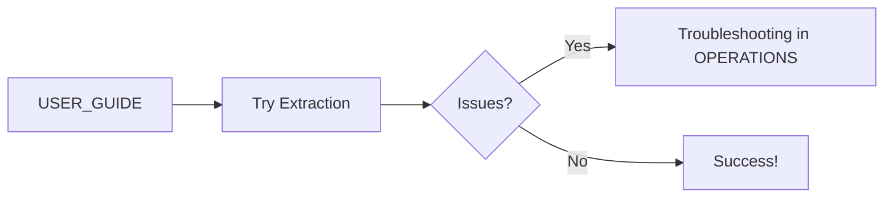

# ChatGPT Conversation Extractor - Documentation Index

## 📚 Complete Documentation Set

This production-ready documentation package provides comprehensive coverage of the ChatGPT Conversation Extractor v2.0 system. Each document serves a specific purpose and audience.

## 🗂️ Documentation Structure

```
docs/
├── INDEX.md                    # This file - documentation overview
├── QUICK_REFERENCE.md          # Developer quick reference card
├── USER_GUIDE.md               # End-user installation and usage
├── ARCHITECTURE.md             # System design and components
├── TECHNICAL_REFERENCE.md     # API reference and data structures
├── OPERATIONS.md               # Runbook and troubleshooting
└── 20_implementation_learnings_and_documentation_gaps.md  # Lessons learned
```

## 📖 Document Guide

### For Different Audiences

#### 👤 **End Users**
Start here if you want to extract your ChatGPT conversations:
1. [USER_GUIDE.md](USER_GUIDE.md) - Complete usage instructions
2. [QUICK_REFERENCE.md](QUICK_REFERENCE.md) - Command reference

#### 👨‍💻 **Developers**
For understanding and extending the codebase:
1. [ARCHITECTURE.md](ARCHITECTURE.md) - System design overview
2. [TECHNICAL_REFERENCE.md](TECHNICAL_REFERENCE.md) - API documentation
3. [QUICK_REFERENCE.md](QUICK_REFERENCE.md) - Quick API reference

#### 🔧 **System Operators**
For running and maintaining the system:
1. [OPERATIONS.md](OPERATIONS.md) - Operational procedures
2. [USER_GUIDE.md](USER_GUIDE.md#troubleshooting) - Basic troubleshooting

#### 🏗️ **Maintainers**
For long-term maintenance and updates:
1. [20_implementation_learnings_and_documentation_gaps.md](20_implementation_learnings_and_documentation_gaps.md) - Critical lessons
2. [TECHNICAL_REFERENCE.md](TECHNICAL_REFERENCE.md#extension-points) - Extension points
3. [ARCHITECTURE.md](ARCHITECTURE.md#future-enhancements) - Roadmap

## 📋 Document Descriptions

### [USER_GUIDE.md](USER_GUIDE.md)
**Purpose**: Complete guide for end users  
**Contents**:
- Quick start instructions
- Installation steps
- How to export ChatGPT data
- Basic and advanced usage
- Output format explanation
- Troubleshooting common issues
- FAQ

**Best For**: First-time users, non-technical users

---

### [ARCHITECTURE.md](ARCHITECTURE.md)
**Purpose**: System design and architecture overview  
**Contents**:
- System overview and capabilities
- Architecture diagrams (Mermaid)
- Component design details
- Data flow diagrams
- Processing pipeline
- Error handling strategy
- Performance characteristics
- Design decisions and trade-offs

**Best For**: Developers, architects, technical reviewers

---

### [TECHNICAL_REFERENCE.md](TECHNICAL_REFERENCE.md)
**Purpose**: Detailed API and implementation reference  
**Contents**:
- Complete API documentation
- Data structure definitions
- Content type registry
- Configuration options
- Extension points
- Error handling patterns
- Performance optimization details

**Best For**: Developers implementing features, debugging

---

### [OPERATIONS.md](OPERATIONS.md)
**Purpose**: Operational runbook and troubleshooting  
**Contents**:
- Pre-operation checklists
- Standard operating procedures
- Monitoring and observability
- Detailed troubleshooting guide
- Recovery procedures
- Maintenance tasks
- Emergency procedures
- Performance tuning

**Best For**: System operators, DevOps, support staff

---

### [QUICK_REFERENCE.md](QUICK_REFERENCE.md)
**Purpose**: Compact reference card for developers  
**Contents**:
- Command line usage
- Key classes and methods
- Content type quick reference
- Critical checks reminder
- Common fixes
- Performance targets
- Quick debugging commands

**Best For**: Active development, quick lookups

---

### [20_implementation_learnings_and_documentation_gaps.md](20_implementation_learnings_and_documentation_gaps.md)
**Purpose**: Lessons learned and gap analysis  
**Contents**:
- Critical implementation fixes
- Documentation gaps discovered
- Undocumented content structures
- Edge cases and solutions
- Updated requirements
- Implementation checklist

**Best For**: Future implementations, understanding why certain decisions were made

## 🔄 Documentation Workflow

### For New Users


### For Developers


### For Operators


## 📊 Key Metrics Across Documentation

| Metric | Value | Reference |
|--------|-------|-----------|
| Success Rate | 99-100% | [ARCHITECTURE.md](ARCHITECTURE.md#performance-characteristics) |
| Processing Speed | 65-100 conv/s | [TECHNICAL_REFERENCE.md](TECHNICAL_REFERENCE.md#performance-optimization) |
| Memory Usage | <2GB | [OPERATIONS.md](OPERATIONS.md#system-requirements-verification) |
| Setup Time | <5 minutes | [USER_GUIDE.md](USER_GUIDE.md#installation) |
| Recovery Time | <1 minute | [OPERATIONS.md](OPERATIONS.md#recovery-procedures) |

## 🔍 Finding Information

### By Topic

**Installation & Setup**
- [USER_GUIDE.md#installation](USER_GUIDE.md#installation)
- [OPERATIONS.md#pre-operation-checklist](OPERATIONS.md#pre-operation-checklist)

**Configuration**
- [TECHNICAL_REFERENCE.md#configuration](TECHNICAL_REFERENCE.md#configuration)
- [USER_GUIDE.md#advanced-usage](USER_GUIDE.md#advanced-usage)

**Error Handling**
- [ARCHITECTURE.md#error-handling-strategy](ARCHITECTURE.md#error-handling-strategy)
- [OPERATIONS.md#troubleshooting-guide](OPERATIONS.md#troubleshooting-guide)
- [TECHNICAL_REFERENCE.md#error-handling-patterns](TECHNICAL_REFERENCE.md#error-handling-patterns)

**Performance**
- [ARCHITECTURE.md#performance-characteristics](ARCHITECTURE.md#performance-characteristics)
- [TECHNICAL_REFERENCE.md#performance-optimization](TECHNICAL_REFERENCE.md#performance-optimization)
- [OPERATIONS.md#performance-tuning](OPERATIONS.md#performance-tuning)

**Extending the System**
- [TECHNICAL_REFERENCE.md#extension-points](TECHNICAL_REFERENCE.md#extension-points)
- [ARCHITECTURE.md#future-enhancements](ARCHITECTURE.md#future-enhancements)

## 🎯 Quick Decision Tree

```
Need to...
├── Extract conversations → USER_GUIDE.md
├── Fix an error → OPERATIONS.md → Troubleshooting
├── Understand the code → ARCHITECTURE.md → TECHNICAL_REFERENCE.md
├── Add new feature → TECHNICAL_REFERENCE.md → Extension Points
├── Optimize performance → OPERATIONS.md → Performance Tuning
├── Quick command lookup → QUICK_REFERENCE.md
└── Understand design decisions → 20_implementation_learnings.md
```

## 📝 Documentation Standards

All documents follow these standards:
- **Markdown formatting** with clear headers
- **Code examples** with syntax highlighting
- **Tables** for structured data
- **Mermaid diagrams** for visual representation
- **Cross-references** between documents
- **Version tracking** in headers
- **Target audience** clearly identified

## 🔄 Maintenance

Documentation should be updated when:
- New features are added
- Bugs are fixed that change behavior
- Performance characteristics change
- New edge cases are discovered
- User feedback indicates confusion

## 📞 Documentation Feedback

For documentation improvements:
1. Check if information exists in another document
2. Verify accuracy with implementation
3. Consider the target audience
4. Maintain consistency across documents
5. Update INDEX.md if structure changes

---

**Documentation Version**: 1.0  
**System Version**: 2.0  
**Last Updated**: 2025-01-12  
**Total Documentation**: ~2,500 lines across 7 documents  

*This documentation set provides complete coverage for users, developers, operators, and maintainers of the ChatGPT Conversation Extractor system.*